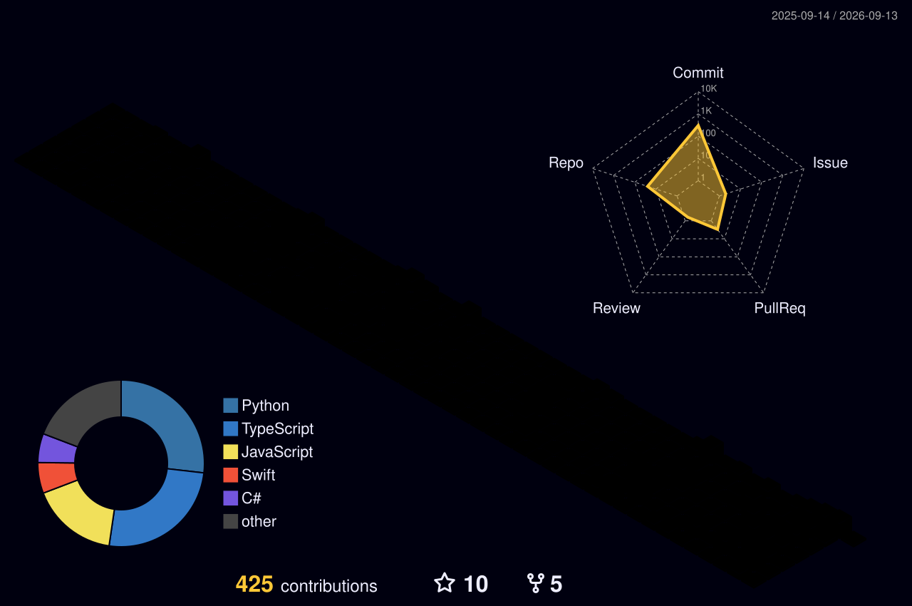

<div align="center">

# 👋 Hey, I'm Eren Akkoç


<br/>

<a href="https://erenakkoc.com">

</a>

<a href="https://linkedin.com/in/ern-akkc">

</a>

<a href="mailto:eren@erenakkoc.com">

</a>

<br/><br/>


</div>

---

## 🧑‍💻 `whoami`

```text
Name        : Eren Akkoç
Role        : Software Engineer
Focus       : Full Stack + AI + Systems
Currently   : Building things
Location    : Türkiye
Website     : erenakkoc.com
Contact     : eren@erenakkoc.com
```

I enjoy building software end-to-end — from architecture and backend systems to AI-powered applications and user interfaces.

My projects often sit at the intersection of:

```text
Web Development
      +
Backend Engineering
      +
Artificial Intelligence
      +
Computer Vision
      +
Automation
      +
Simulation
      +
Developer Tooling
```

---

## ⚡ What I Like Building

### 🌐 Full Stack Systems

`Next.js` `React` `TypeScript` `Node.js` `NestJS` `Express`

`PostgreSQL` `MongoDB` `Redis` `Prisma`

Authentication · Authorization · REST APIs · WebSockets · Real-time systems · Monorepos

### 🤖 AI / ML

`Python` `PyTorch` `TensorFlow` `OpenCV`

LLMs · AI Agents · Computer Vision · Image Processing · Automation

### 🖥️ Native / Desktop

`Swift` `SwiftUI` `SwiftData`

`C#` `.NET`

`PyQt5` `PyQt6`

### 🛩️ UAV / Robotics / Simulation

`MAVLink` `PyMAVLink` `ArduPilot`

`ROS2` `Gazebo` `MAVSDK`

---

# 🚀 Featured Projects

<table>
<tr>

<td width="50%" valign="top">

## 🎓 ErciyesMezunAğı

Full-stack alumni networking platform.

**Stack**

`Next.js` `NestJS` `TypeScript`

`Prisma` `PostgreSQL` `Socket.IO`

**Features**

Authentication
Mentorship
Real-time Chat
WebSockets
Role-based architecture

[View Repository →](https://github.com/ernakkc/ErciyesMezunAgi)

</td>

<td width="50%" valign="top">

## 🧠 Synapse

AI-focused experimentation around intelligent assistants, memory and LLM-driven workflows.

**Focus**

`AI` `LLM` `Memory`

`TypeScript` `SQLite`

[View Repository →](https://github.com/ernakkc/Synapse)

</td>

</tr>

<tr>

<td width="50%" valign="top">

## 🧩 Sudoku Solver

Computer vision + AI + SAT solving.

**Stack**

`Python` `PyQt5` `OpenCV`

`Gemini` `Python-SAT`

Image → Board Detection → Digit Recognition → Solver

[View Repository →](https://github.com/ernakkc/sudoku-solver)

</td>

<td width="50%" valign="top">

## 🛩️ Savaşan İHA

Ground control and flight communication software for UAV competition systems.

**Stack**

`Python` `PyQt6`

`MAVLink` `PyMAVLink`

`ArduPilot`

[View Repository →](https://github.com/ernakkc/SavasanIHA-2026-Tarabozan-Alpleri)

</td>

</tr>

<tr>

<td width="50%" valign="top">

## 💰 ButceTakip

Native personal finance application.

**Stack**

`Swift` `SwiftUI` `SwiftData`

[View Repository →](https://github.com/ernakkc/ButceTakip)

</td>

<td width="50%" valign="top">

## 🌍 Virtual Ecosystem

Experimental ecosystem simulation.

**Stack**

`C#` `.NET`

Simulation · Entities · World Systems

[View Repository →](https://github.com/ernakkc/ecosystem)

</td>

</tr>

</table>

---

# 🧠 Currently Exploring

```text
┌─────────────────────────────────────────────────────┐
│                                                     │
│   System Design          ████████████████░░░░       │
│   AI Agents              █████████████████░░░       │
│   Backend Architecture   █████████████████░░░       │
│   Computer Vision        ███████████████░░░░░       │
│   Real-Time Systems      ███████████████░░░░░       │
│   Native Development    ████████████░░░░░░░       │
│                                                     │
└─────────────────────────────────────────────────────┘
```

---

# 🖥️ Developer Terminal

```text
eren@dev-machine ~ % neofetch

        ████████
      ██        ██
     ██   EREN   ██
      ██        ██
        ████████

OS              macOS
Role            Software Engineer
Primary Stack   TypeScript / Node.js
AI Stack        Python / PyTorch / OpenCV
Native          Swift / C#
Databases       PostgreSQL / MongoDB / Redis
Infrastructure  Docker
Realtime        WebSockets / Socket.IO
Current Mode    BUILDING 🚀
```

---

# 🧰 Technology Stack

<div align="center">


<br/><br/>


<br/><br/>


<br/><br/>


</div>

---

# 📈 GitHub Activity

<div align="center">



</div>

---

# 🐍 Contribution Snake

<div align="center">


</div>

---

# 📊 GitHub Overview

<div align="center">


</div>

---


# 📫 Let's Talk

I'm interested in:

`Software Engineering`

`AI / ML`

`Backend Systems`

`Open Source`

`Interesting Projects`

`Collaboration`

### 📧

**[eren@erenakkoc.com](mailto:eren@erenakkoc.com)**
**[erenakkoc.com](erenakkoc.com)**

Feel free to reach out.

---

<div align="center">

### 💻 Build. Break. Learn. Repeat.

<br/>


</div>
